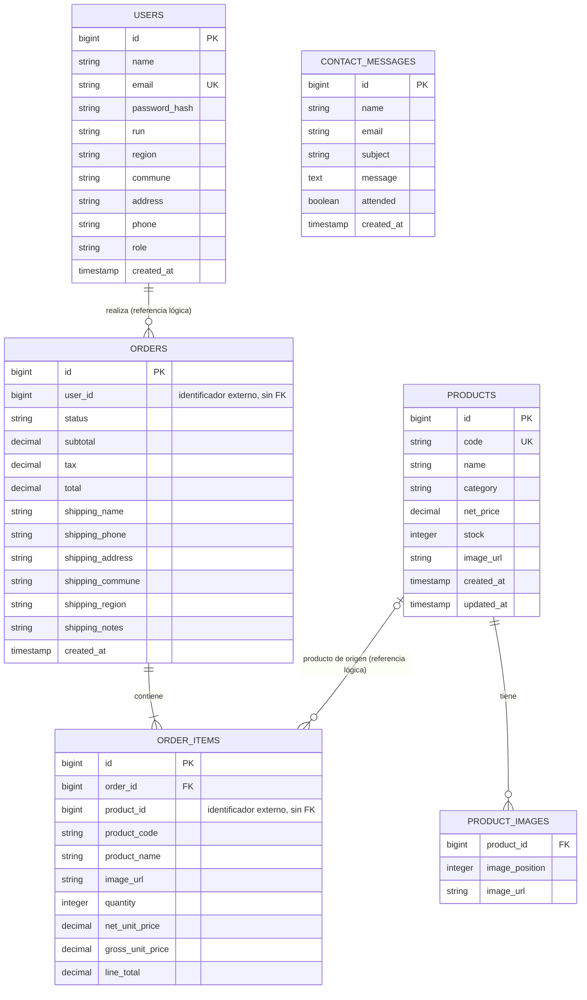

# Modelo entidad-relación de Prostock

El siguiente modelo separa las entidades por servicio. Las relaciones entre
servicios son referencias por identificador, no claves foráneas compartidas:
cada microservicio es dueño de sus datos y de su base PostgreSQL.

## Propiedad de los datos

| Servicio | Base de datos | Entidades |
| --- | --- | --- |
| `identity-service` | `prostock_identity` | usuarios y credenciales |
| `catalog-service` | `prostock_catalog` | productos e inventario |
| `order-service` | `prostock_orders` | pedidos y líneas de pedido |
| `contact-service` | `prostock_contact` | mensajes de contacto |

`user_id` y `product_id` en pedidos son referencias lógicas a otros servicios.
El pedido conserva además una copia del nombre, código, imagen y precios del
producto para que el historial no cambie cuando se edite el catálogo.
`orders.user_id` tampoco lleva una FK a usuarios: la base de identidad pertenece
a otro servicio.

El catálogo de artículos del blog y la página institucional son contenido
estático de la aplicación, por lo que no aparecen como tablas en este MER.
