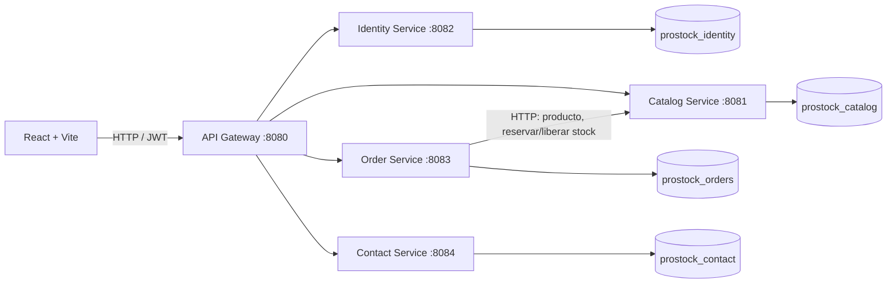

# Arquitectura de microservicios

El navegador solo necesita conocer el gateway. En Docker, los servicios y
PostgreSQL se comunican por una red privada; los puertos de los servicios no
se publican en el host.

## Límites de servicio

- **Identidad:** alta de clientes, inicio de sesión, hash BCrypt y emisión de
  JWT de 8 horas con `userId` y rol.
- **Catálogo:** productos, búsquedas por id/listado y reservas atómicas de
  inventario.
- **Pedidos:** validación del usuario del token, importes calculados con el
  precio que responde Catálogo, instantánea de productos y datos de despacho.
- **Contacto:** recepción pública de consultas; consulta, eliminación y cambio
  de estado reservados a administradores.
- **Gateway:** CORS, verificación JWT, autorización por rol y enrutamiento HTTP.

## Recorrido de una compra

1. React envía el usuario autenticado, los productos y los datos de despacho a
   `POST /api/orders`.
2. Pedidos verifica que el `usuarioId` coincida con el token y pide a Catálogo
   el precio actual de cada producto.
3. Catálogo reserva el stock con una actualización atómica que solo descuenta
   si existe stock suficiente.
4. Pedidos calcula subtotal, IVA y total con precios del servidor, guarda el
   pedido y copia las líneas para mantener el historial.
5. Si falla la reserva de otra línea o el guardado del pedido, Pedidos intenta
   liberar las reservas ya efectuadas.

La compensación de inventario es síncrona y tiene registro de error, pero no
cuenta con cola durable ni reintentos. Para un entorno real conviene agregar
outbox/eventos, claves de idempotencia, observabilidad y políticas de
reconciliación.
